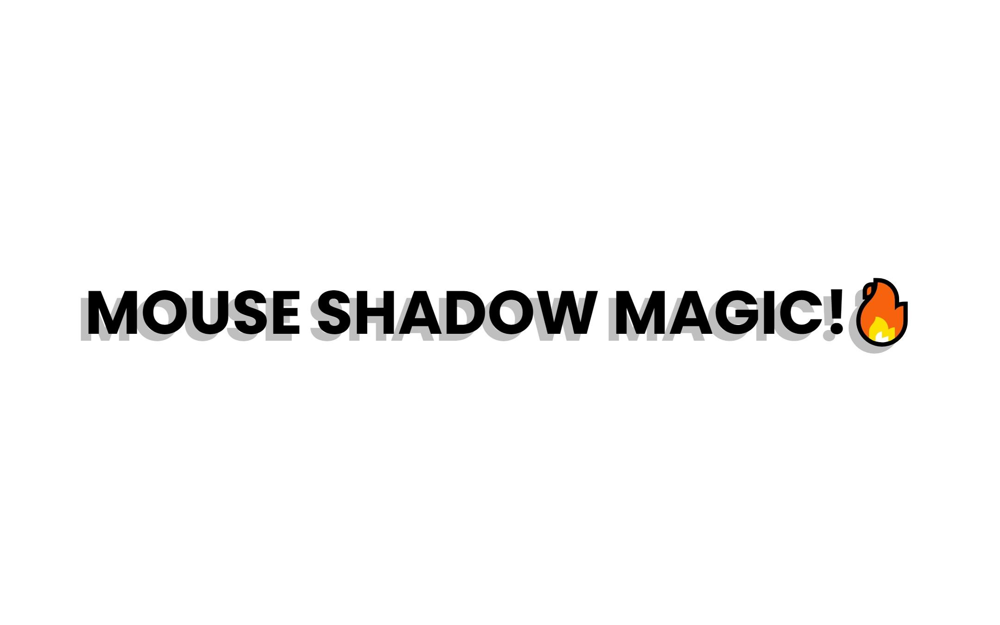

# Mouse Move Shadow

An interactive webpage that displays dynamic mouse shadow effects, creating a visually engaging experience. As users move their mouse across the page, the title's shadow responds to their movement, providing an engaging and magical effect.

## Description

This project demonstrates a dynamic mouse shadow effect where the title's shadow moves in response to the mouse's position on the page. The shadow's movement is calculated based on the user's cursor location, making for a fun and interactive effect. Built with HTML, CSS, and JavaScript, this project incorporates modern CSS features like `clamp()` for responsive design and JavaScript to handle mouse interactions and real-time updates.

## Features

- **Interactive Shadow Effect**: The title's shadow moves in real time based on the user's mouse position on the page.
- **Responsive Design**: The font size of the title adjusts dynamically across various screen sizes using `clamp()`.
- **Modern CSS Techniques**: Uses Flexbox for centering content and CSS variables for easy color customization.
- **Smooth Animations**: Text shadow smoothly adjusts based on the mouse's X and Y positions.
- **Simple and Lightweight**: Minimal HTML, CSS, and JavaScript for a quick, responsive experience.

## Technologies Used

- HTML
- CSS
- JavaScript

## How to Run

1. Clone the repository to your local machine.
2. Open `index.html` in your web browser.
3. Alternatively, you can view the live project on GitHub Pages: [Mouse Move Shadow on GitHub Pages](https://deannamandarino.github.io/mouse-move-shadow/).

## Acknowledgments

This project was completed as part of the JavaScript30 course. Special thanks to Wes Bos for the excellent resources and guidance throughout the course.